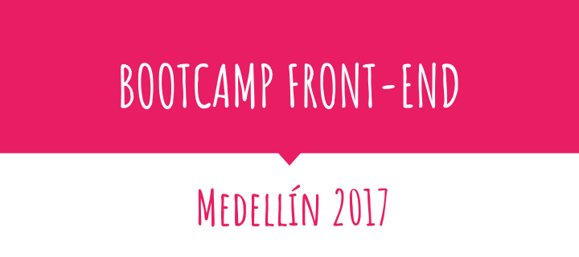

  

## 🎓 Bootcamp Front-end
  Este Bootcamp Front-end es ofrecido por ___World Tech Makers Academy S.A.S___, quien ofrece cursos presenciales y virtuales de formación académica no formal sobre desarrollo de técnicas de programación.

## 💜 Slides:

  > <https://goo.gl/wTAkbm>

## 📆 Fechas:

___Semana___ | ___Fecha___ | ___Temas___
:--: | :--: | :--:
1 | Del 27 junio al 1 julio | Introduction to: Git and GitHub, Webtask, Markdown, HMTL, CSS
2 | Del 4 julio al 8 julio | SCRUM, Introduction to JavaScript, Semantic HTML 
3 | Del 10 julio al 15 julio | CSS Advanced Positioning, Responsive Design, SS Grid Layout,Web Typografy, Introduction to Scrum, GitHub, Open Source, jQuery
4 | Del 17 julio al 22 julio | Basic Regex, JavaScript Prototypes, Functional JavaScript, ES2015, Instroduction to Webpack, Setting up Babel, Unit Testing with AVA, SASS, BEN/SMACSS
5 | Del 24 julio al 29 julio | Bootstrap, Semantic UI, Excercise: App Dashboard, Introduction to React, Introduction to Redux, CSS in JS, Playing with Next.js, Setting up a React App from Scratch
6 | Del 31 julio al 5 agosto | Node.js, Express, Webpack with Express, MongoDB, Introduction to SQL, Building a API
7 | Del 8 agosto al 12 agosto | Setting up a Digital Ocean Server, Advanced Webpack, Hot Module Replacement, Using Now fro deployment
8 | Del 14 agosto al 19 agosto |
9 | Del 22 agosto al 26 agosto |
